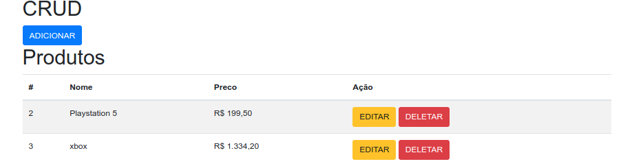

# Projeto CRUD Django 

> Um simples crud com django usando SQLite3

<!-- Informações curtas sobre o projeto -->
Esse projeto tem o objetivo de mostrar a estrutrua de um código de forma simples através de um crud usando o framework django 
<!-- Fim informações curtas -->

<!-- Aqui colocamos um scress shot do projeto -->

<!-- Fim screen shots -->

 

 

Seu nome - [@AdrianoRobson](https:Adriano08andrade@hotmail.com)

[https://github.com/AdrianoRobson/crud-django](https://github.com/AdrianoRobson/crud-django)

<!-- Fim informações sobre o criador -->
 